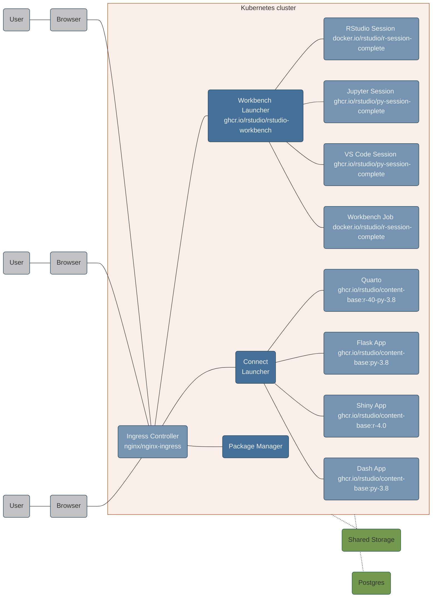

# Mermaid diagram

```mermaid
flowchart LR
u1(User)
u2(User)
u3(User)
b1(Browser)
b2(Browser)
b3(Browser)
ingress(Ingress Controller <br/> nginx/nginx-ingress)
workbench(Workbench <br/> Launcher <br/> ghcr.io/rstudio/rstudio-workbench)
connect(Connect <br/> Launcher)
packagemanager(Package Manager)
rsession(RStudio Session <br/> docker.io/rstudio/r-session-complete)
jupyter(Jupyter Session <br/> ghcr.io/rstudio/py-session-complete)
vscode(VS Code Session <br/> ghcr.io/rstudio/py-session-complete)
job(Workbench Job <br/> docker.io/rstudio/r-session-complete)
qmd(Quarto<br/>ghcr.io/rstudio/content-base:r-40-py-3.8)
flask(Flask App<br/>ghcr.io/rstudio/content-base:py-3.8)
shiny(Shiny App<br/>ghcr.io/rstudio/content-base:r-4.0)
dash(Dash App<br/>ghcr.io/rstudio/content-base:py-3.8)
nfs(Shared Storage)
pg(Postgres)


u1---b1
u2---b2
u3---b3
b1---ingress
b2---ingress
b3---ingress

subgraph k8s [Kubernetes cluster]
    ingress---workbench
    ingress---connect
    ingress---packagemanager
    workbench---rsession
    workbench---jupyter
    workbench---vscode
    workbench---job
    connect---qmd
    connect---flask
    connect---shiny
    connect---dash
end

k8s-..-pg
k8s-..-nfs

classDef server fill:#FAEEE9,stroke:#ab4d26
classDef product fill:#447099,stroke:#213D4F,color:#F2F2F2
classDef session fill:#7494B1,color:#F2F2F2,stroke:#213D4F
classDef element fill:#C2C2C4,stroke:#213D4F
classDef req fill:#72994E,stroke:#1F4F4F

class k8s server
class workbench,connect,packagemanager product
class ingress,rsession,jupyter,vscode,job,qmd,flask,shiny,dash session
class u1,u2,u3,b1,b2,b3,lb element
class pg,nfs req
```
